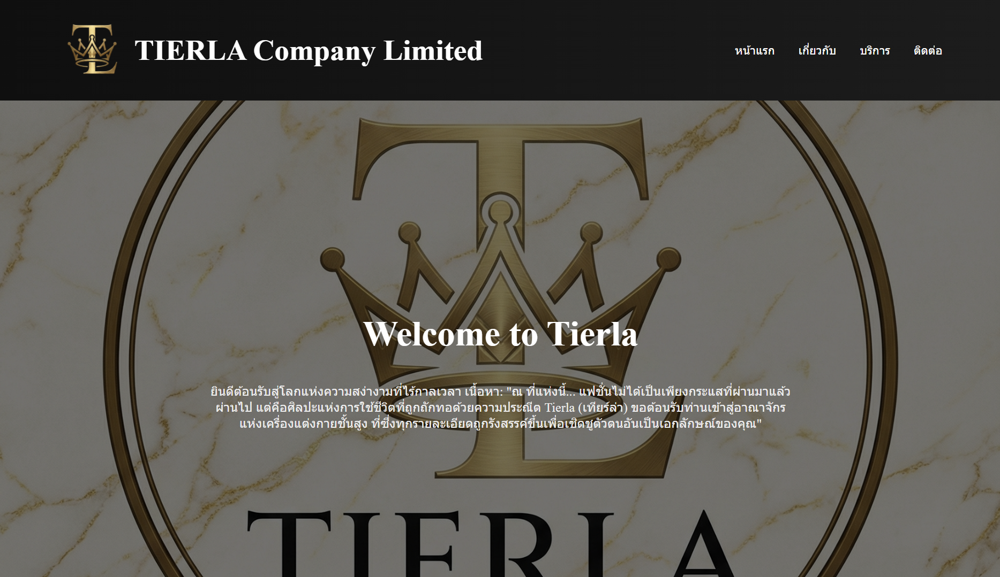
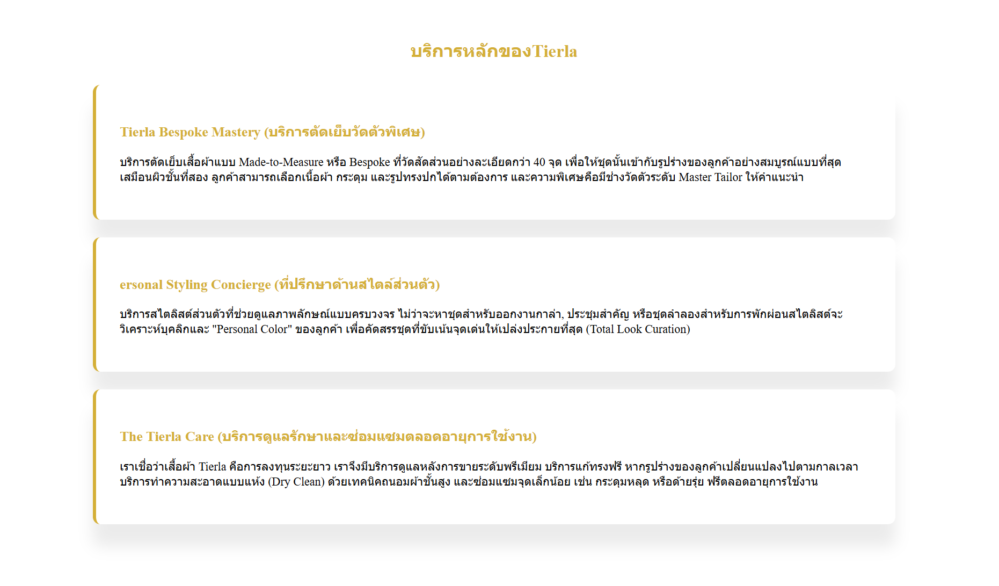
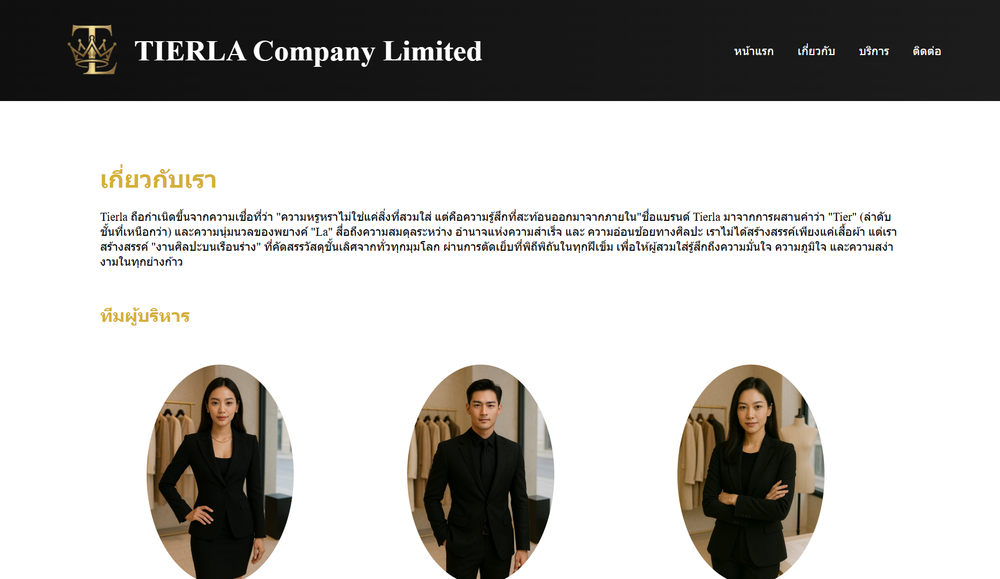
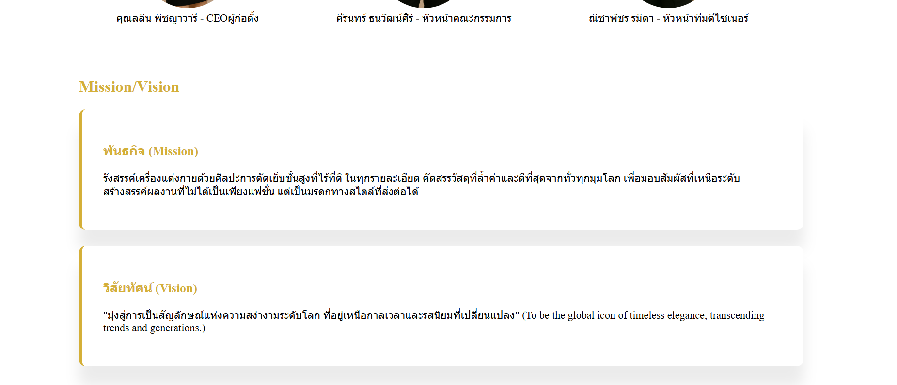
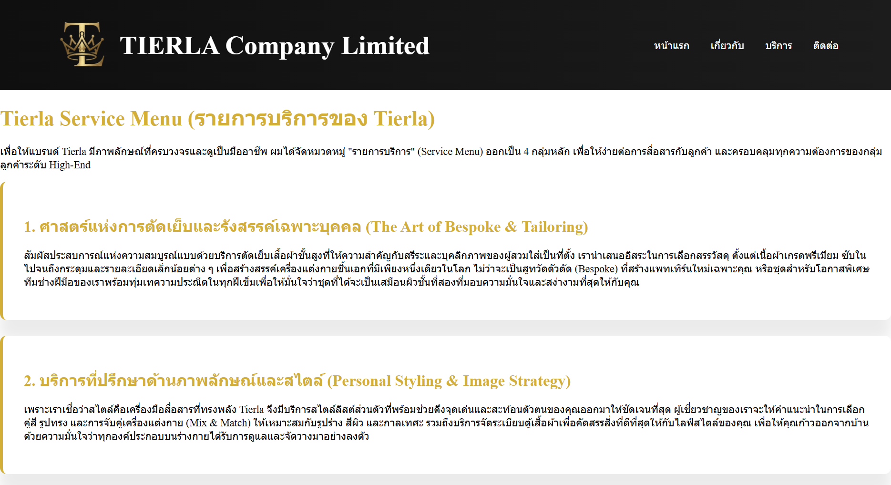
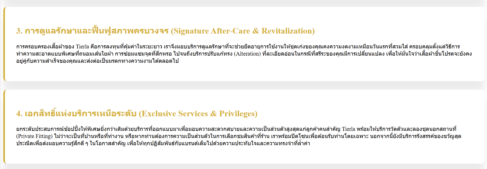
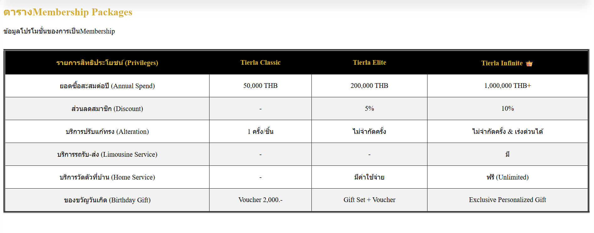
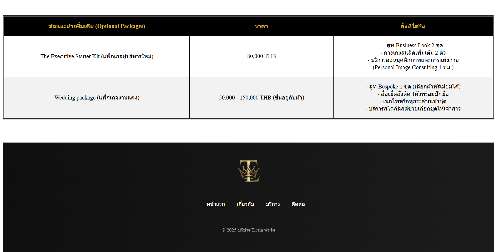

# My Business Web: Tierla Co., Ltd.

เว็บไซต์จำลองของ บริษัท Tierla จำกัด (Tierla Co., Ltd.)

## ข้อมูล Assignment#1

เว็บไซต์นี้ประกอบด้วย 4 หน้าหลัก ได้แก่ หน้าแรก, เกี่ยวกับเรา, บริการ, และติดต่อเรา

## โครงสร้างไฟล์

- index.html : หน้าแรก (Home)
- about.html : หน้าเกี่ยวกับเรา (About Us)
- services.html : หน้าบริการ (Services)
- contact.html : หน้าติดต่อเรา (Contact)
- images/ : โฟลเดอร์เก็บรูปภาพ (logo.png, CEO.jpg, MD.jpg)
- screenshots/ : โฟลเดอร์เก็บรูปภาพหน้าจอ
- README.md : เอกสารประกอบโปรเจกต์

## ลิงก์เข้าสู่หน้าเว็บ

- [หน้าแรก](index.html)
- [เกี่ยวกับเรา](about.html)
- [บริการของเรา](services.html)
- [ติดต่อเรา](contact.html)

## รายละเอียดการออกแบบและสิ่งที่พัฒนาเพิ่มเติม

### 🔹 Header & Navigation

- ใช้ Flexbox จัด Layout
- พื้นหลังแบบ Gradient สีดำ
- เมนูมี Hover Effect พร้อมเส้นใต้แบบ Animation

### 🔹 Hero Section

- ใช้ภาพพื้นหลังพร้อม Overlay สีดำ
- จัดเนื้อหาให้อยู่กึ่งกลางหน้าจอ
- สื่อถึงภาพลักษณ์แบรนด์ระดับ Luxury

### 🔹 Content & Card Design

- ใช้ Card Layout พร้อม Shadow
- มี Transition เมื่อ Hover
- ใช้สีทอง (#d4af37) เป็นสีหลักของแบรนด์

### 🔹 About Us & Team

- ใช้ `<figure>` และ `<figcaption>`
- รูปทีมผู้บริหารเป็นทรงกลม
- แยก Mission / Vision ชัดเจน

### 🔹 Services & Membership Table

- ตารางเปรียบเทียบแพ็กเกจสมาชิก
- จัดรูปแบบตารางให้อ่านง่าย
- แยกบริการเป็นหมวดหมู่

### 🔹 Contact Form

- ฟอร์มกรอกข้อมูลครบถ้วน
- มี Radio Button (เพศ: ชาย / หญิง / อื่นๆ)
- มี Checkbox ยอมรับเงื่อนไขการใช้บริการ
- ใช้ Fieldset และ Legend เพื่อความเป็นระเบียบ

### 🔹 Footer

- โครงสร้างชัดเจน
- มีเมนูนำทางซ้ำ
- แสดงลิขสิทธิ์บริษัท

---

## รูปหน้าจอเว็บไซต์ทั้งหมด (Screenshots)

### 1. หน้าแรก

### 2. หน้าเกี่ยวกับเรา

### 3. หน้าบริการ

### 4. หน้าติดต่อเรา

## ผู้จัดทำ

ชื่อ-นามสกุล: นางสาวจตุพร ธรรมฤทธิ์
รหัสนักศึกษา: 67160178
