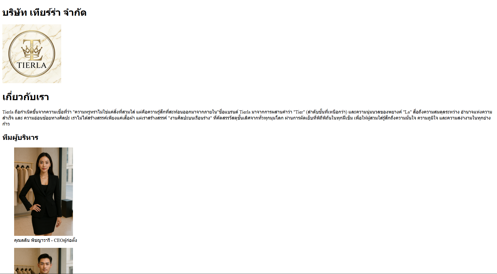
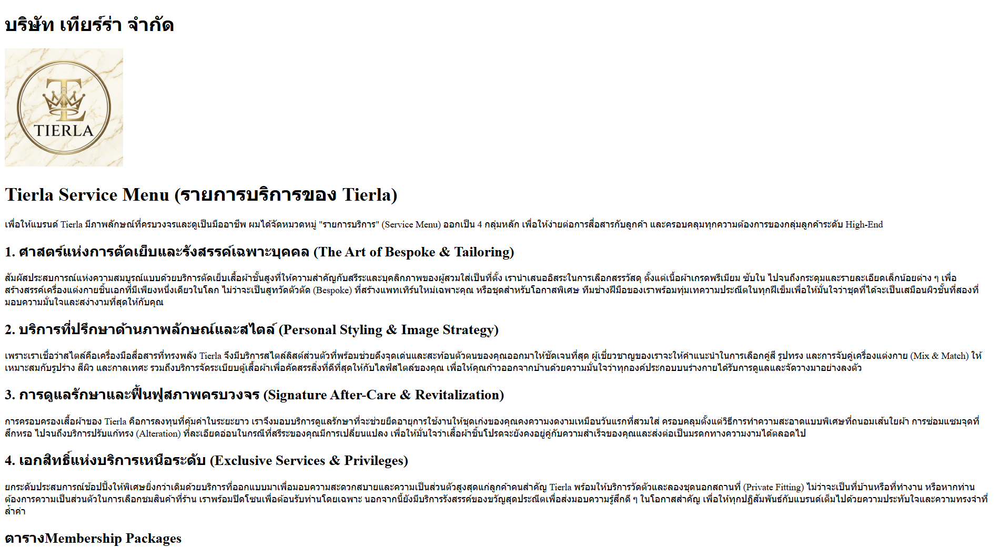
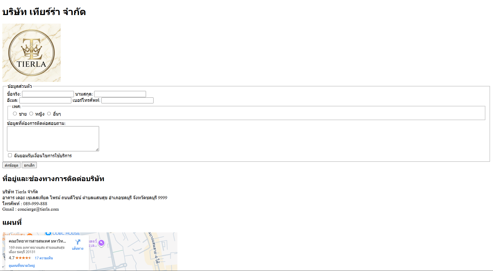

# My Business Web: Tierla Co., Ltd.

เว็บไซต์จำลองของ บริษัท Tierla จำกัด (Tierla Co., Ltd.)

## ข้อมูล Assignment#1

เว็บไซต์นี้ประกอบด้วย 4 หน้าหลัก ได้แก่ หน้าแรก, เกี่ยวกับเรา, บริการ, และติดต่อเรา

## โครงสร้างไฟล์

- index.html : หน้าแรก (Home)
- about.html : หน้าเกี่ยวกับเรา (About Us)
- services.html : หน้าบริการ (Services)
- contact.html : หน้าติดต่อเรา (Contact)
- images/ : โฟลเดอร์เก็บรูปภาพ (logo.png, CEO.jpg, MD.jpg)
- screenshots/ : โฟลเดอร์เก็บรูปภาพหน้าจอ
- README.md : เอกสารประกอบโปรเจกต์

## ลิงก์เข้าสู่หน้าเว็บ

- [หน้าแรก](index.html)
- [เกี่ยวกับเรา](about.html)
- [บริการของเรา](services.html)
- [ติดต่อเรา](contact.html)

## รูปหน้าจอทั้งหมด (Screenshots)

### 1. หน้าแรก

### 2. หน้าเกี่ยวกับเรา

### 3. หน้าบริการ

### 4. หน้าติดต่อเรา

## ผู้จัดทำ

ชื่อ-นามสกุล: นางสาวจตุพร ธรรมฤทธิ์
รหัสนักศึกษา: 67160178
